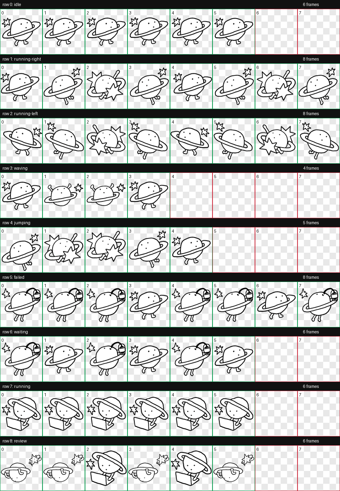

# 행성이 Codex Pet

손그림 행성 캐릭터 `행성이`를 Codex Desktop의 `/pet` 커스텀 펫으로 사용할 수 있게 만든 배포용 패키지입니다.



## 구성

```text
pets/
└── haengseongi/
    ├── pet.json
    └── spritesheet.webp
```

Codex 커스텀 펫은 로컬의 `${CODEX_HOME:-$HOME/.codex}/pets/<pet-name>/` 아래에 `pet.json`과 `spritesheet.webp`가 있으면 로드됩니다.

## 빠른 설치

아래 명령을 터미널에서 실행합니다.

```bash
curl -fsSL https://raw.githubusercontent.com/JetProc/haengseongi-codex-pet/v0.1.3/install.sh | bash
```

설치가 끝나면 Codex에서 `/pet`을 열고 `Refresh`를 누른 뒤 `행성이`를 선택하면 됩니다. `/pet`이 바로 열리지 않거나 펫이 보이지 않는 경우에는 `Settings` -> `Appearance` 하단의 `Pets` 영역에서 `Wake Pet`을 누른 뒤 `Refresh`와 선택을 진행하면 됩니다.

## 수동 설치

스크립트를 쓰지 않고 직접 설치하려면 이 저장소의 `pets/haengseongi` 폴더를 아래 위치로 복사합니다.

```text
~/.codex/pets/haengseongi/
```

최종 파일 구조가 이렇게 되어야 합니다.

```text
~/.codex/pets/haengseongi/
├── pet.json
└── spritesheet.webp
```

`CODEX_HOME`을 별도로 쓰고 있다면 `~/.codex` 대신 `${CODEX_HOME}` 아래의 `pets/haengseongi`에 넣으면 됩니다.

## Codex에서 선택하기

가장 빠른 방법은 `/pet` 명령을 쓰는 것입니다.

1. Codex Desktop을 엽니다.
2. 입력창에 `/pet`을 입력합니다.
3. `Pets` 영역을 펼칩니다.
4. `Refresh`를 누릅니다.
5. 커스텀 목록에서 `행성이`를 선택합니다.
6. 펫이 숨어 있다면 `Wake Pet`을 누릅니다.

`/pet`이 뜨지 않거나 목록이 갱신되지 않는다면 설정 화면에서 직접 열 수 있습니다.

1. Codex Desktop의 `Settings`를 엽니다.
2. `Appearance`로 이동합니다.
3. 하단의 `Pets` 영역에서 `Wake Pet`을 누릅니다.
4. `Refresh`를 누른 뒤 `행성이`를 선택합니다.

Codex가 이미 실행 중인 상태에서 파일을 복사했다면 바로 보이지 않을 수 있습니다. 이때는 `Refresh`를 누르거나 Codex 앱을 재시작하면 됩니다.

## 문제 해결

`행성이`가 목록에 보이지 않는다면 먼저 파일 위치를 확인합니다.

```bash
ls ~/.codex/pets/haengseongi
```

아래 두 파일이 보여야 합니다.

```text
pet.json
spritesheet.webp
```

`Unable to load custom pets`가 표시되면 `pet.json`이 올바른 JSON인지 확인합니다.

```json
{
  "id": "haengseongi",
  "displayName": "행성이",
  "description": "A tiny hand-drawn planet companion for quiet orbiting, coding, coffee, and review moments.",
  "spritesheetPath": "spritesheet.webp"
}
```

스프라이트 파일은 Codex 펫 규격에 맞는 `1536x1872` 크기의 투명 배경 WebP입니다.

## 삭제하기

행성이를 제거하려면 설치 폴더를 지우면 됩니다.

```bash
rm -rf ~/.codex/pets/haengseongi
```

그다음 Codex에서 `/pet`을 열고 `Refresh`를 누르면 목록에서 사라집니다.

## 라이선스

- 캐릭터와 스프라이트 이미지: `CC BY-NC 4.0`
- 설치 스크립트와 문서: `MIT`

행성이 캐릭터를 개인 Codex 환경에서 쓰거나 공유하는 것은 자유롭게 허용합니다. 상업적 사용, 굿즈 제작, 캐릭터 재배포 상품화는 별도 허락을 받아주세요.
